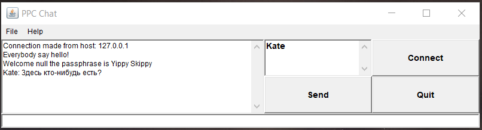
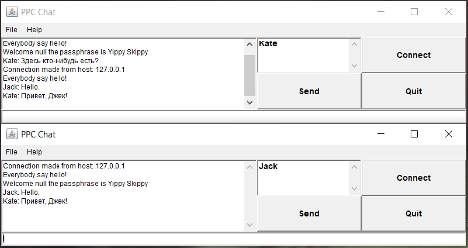
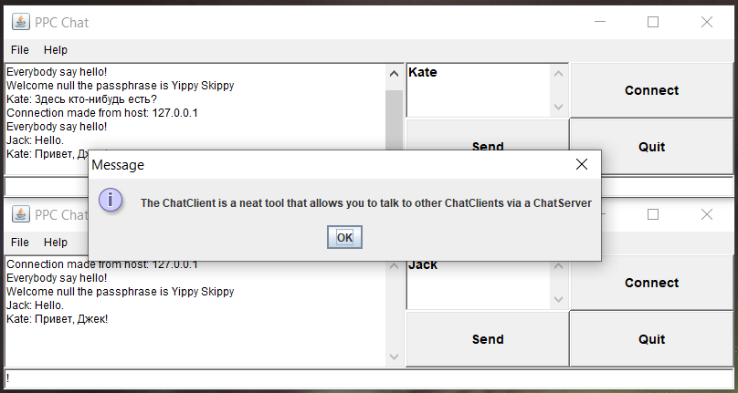

# Результат

## Завдання на "п'ять"
1. змінила код клієнта так, щоб користувач міг сам ввести ім'я для використання в чаті
2. змінила код клієнта так, щоб при запуску форма з'являлась в центрі екрану
3. змінила код клієнта так, щоб вікно "Про програму" (About) відображалось з використанням класу JOptionPane
4. позбавилась від використання файлу хостів в коді сервера.
5. реалізувала підтримку кирилиці - кодування UTF-8.

